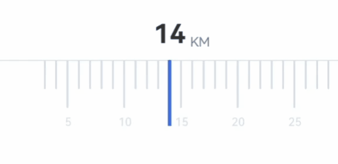
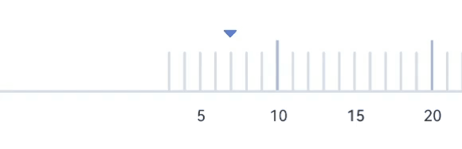
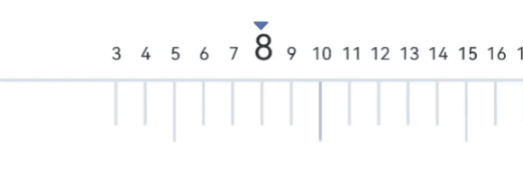
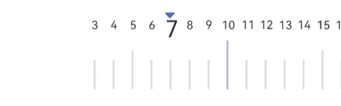

# 简单易用的刻度尺控件

效果图









简介该控件可自由配置起始值，结束值，刻度间距。中高刻度样式等等

| initValue              | integer          | 设置初始指向的刻度             |
| ---------------------- | ---------------- | ------------------------------ |
| scaleTextSize          | dimension        | 刻度值字体大小                 |
| scaleTextColor         | reference\|color | 刻度值字体颜色                 |
| scaleTextZoomSize      | dimension        | 刻度值放大字体大小             |
| scaleSpace             | dimension        | 刻度距离间距                   |
| lowScaleLineColor      | reference\|color | 低刻度值颜色                   |
| middleScaleLineColor   | reference\|color | 中刻度值颜色                   |
| highScaleLineColor     | reference\|color | 高刻度值颜色                   |
| lowScaleHeight         | dimension        | 低刻度线高度                   |
| middleScaleHeight      | dimension        | 中刻度线高度                   |
| heightScaleHeight      | dimension        | 高刻度线高度                   |
| scaleStartValue        | integer          | 刻度启始值                     |
| scaleEndValue          | integer          | 刻度终值                       |
| showMiddleScaleLine    | boolean          | 是否显示中刻度线               |
| showHeightScaleLine    | boolean          | 是否显示高刻度线               |
| showLowScaleLine       | boolean          | 是否显示低刻度线               |
| showMiddleScaleNumber  | boolean          | 是否显示中刻度值               |
| showLowScaleNumber     | boolean          | 是否显示低刻度值               |
| showHeightScaleNumber  | boolean          | 是否显示高刻度值               |
| zoom                   | boolean          | 开启刻度值放大效果             |
| roundScaleLine         | boolean          | 开启刻度线圆角                 |
| lowScaleStrokeWidth    | dimension        | 低刻度线宽度                   |
| middleScaleStrokeWidth | dimension        | 中刻度线宽度                   |
| highScaleStrokeWidth   | dimension        | 高刻度线宽度                   |
| valueScaleSpace        | dimension        | 紧贴模式下数值和刻度之间的间隔 |
| middleSpaceValueSpace  | integer          | 相邻的中刻度之间间隔的的刻度数 |
| highSpaceValeSpace     | integer          | 相邻的高刻度之间间隔的的刻度数 |
| showCenterLine         | boolean          | 是否显示中心线                 |
| centerLineStrokeWidth  | dimension        | 中心线宽度                     |
| centerLineColor        | reference\|color | 中心线颜色                     |

```
<!--布局模式-->
        <attr name="viewStyle">
            <enum name="valueDownScaleUpStyle" value="1"/>
            <enum name="valueUpScaleDownStyle" value="2"/>
            <enum name="valueDownScaleUpCloseStyle" value="3"/>
            <enum name="valueUpScaleDownCloseStyle" value="4"/>
        </attr>
```

使用

```xml
<com.h.ruler.RuleView
    android:id="@+id/rule_view"
    android:layout_width="match_parent"
    android:layout_height="70dp"
    app:centerLineColor="#DADEEC"
    app:heightScaleHeight="50dp"
    app:highScaleLineColor="#AAB7E3"
    app:highScaleStrokeWidth="2dp"
    app:initValue="15"
    app:layout_constraintBottom_toBottomOf="parent"
    app:layout_constraintEnd_toEndOf="parent"
    app:layout_constraintStart_toStartOf="parent"
    app:layout_constraintTop_toTopOf="parent"
    app:lowScaleHeight="30dp"
    app:lowScaleLineColor="#DADEEC"
    app:lowScaleStrokeWidth="2dp"
    app:middleScaleHeight="40dp"
    app:middleScaleLineColor="#DADEEC"
    app:middleScaleStrokeWidth="2dp"
    app:scaleEndValue="100"
    app:scaleSpace="20dp"
    app:scaleStartValue="3"
    app:scaleTextColor="#323232"
    app:scaleTextSize="12sp"
    app:scaleTextZoomSize="24sp"
    app:showMiddleScaleLine="true"
    app:showHeightScaleLine="true"
    app:showLowScaleNumber="true"
    app:showCenterLine="false"
    app:valueScaleSpace="14dp"
    app:viewStyle="valueUpScaleDownStyle"
    app:zoom="true" />
```